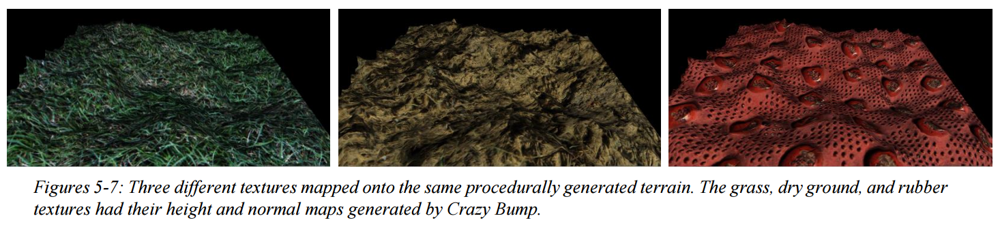

# Normal and Parallax Mapping in three.js

> [!WARNING]
> Archived and no longer maintained; kept for reference. Written in fall 2014 against the three.js release bundled in `js/lib/` (WebGL 1), and not tested in current browsers.

- [Normal and Parallax Mapping in three.js](#normal-and-parallax-mapping-in-threejs)
  - [Overview](#overview)
    - [What it does](#what-it-does)
  - [Screenshots](#screenshots)
  - [Running it](#running-it)
  - [What's in here](#whats-in-here)
  - [Credits](#credits)

## Overview

A three.js scene that adds depth to flat textures on a procedurally generated terrain, using normal mapping and parallax mapping in a custom vertex and fragment shader.

A project for CSCI 441, a graduate computer graphics course at the University of Montana, fall 2014. Normal and parallax mapping are cheap stand-ins for displacement mapping: the geometry stays flat, but the lighting and texture coordinates make it look like it has depth.

**Tech:** JavaScript, three.js, GLSL, dat.GUI

### What it does

- Generates a random terrain mesh (`js/TerrainGenerator.js`)
- Moves everything into tangent space in the vertex shader, so it can be compared against the normal map
- Parallax mapping shifts each texel's UV coordinate using the height map and the view direction
- Normal mapping blends the geometry's normal with the normal map using the "whiteout" method from *Blending in Detail*
- Lights it with a Lambertian directional light plus ambient light
- Lets you switch between grass, dry ground, and rubber textures, turn normal and parallax mapping on and off to see what each one adds, and adjust the light, terrain roughness, and parallax scale and bias

## Screenshots



## Running it

The scene loads its textures as images, so serve the folder instead of opening `index.html` from disk:

```bash
python3 -m http.server
```

Then open <http://localhost:8000>.

## What's in here

| Path | What it is |
|---|---|
| `index.html`, `js/TerrainScene.js` | The scene, UI, and texture setup |
| `js/TerrainShader.js` | The vertex and fragment shaders |
| `js/TerrainGenerator.js` | Procedural terrain generation |
| `assets/` | Color, normal, displacement, occlusion, and specular maps for each texture |
| `Gross_Angela_Project_2_Paper.pdf` | The project paper: theory, process, results, and references |
| `Gross_Angela_Project_2_Source_Code_Verification.pdf` | The shaders, annotated line by line with the source behind each step |
| `Gross_Angela_Project_2_Presentation.pptx`, `Gross-Angela_CSCI-441_Project-2-Planning-Document.pdf` | The class presentation and planning document |

## Credits

- [three.js](https://github.com/mrdoob/three.js), [dat.GUI](https://github.com/dataarts/dat.gui), [tween.js](https://github.com/tweenjs/tween.js), jQuery, and sprintf.js are bundled in `js/lib/` under their own licenses
- Normal blending: Colin Barré-Brisebois and Stephen Hill, [Blending in Detail](https://blog.selfshadow.com/publications/blending-in-detail/)
- Parallax mapping: Mátyás Premecz, *Iterative Parallax Mapping with Slope Information*
- The texture height and normal maps were generated with CrazyBump; the full reference list is in the paper
